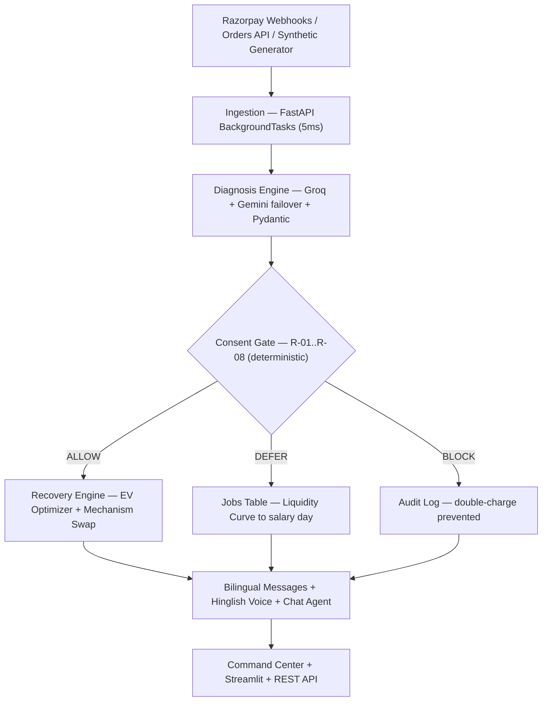
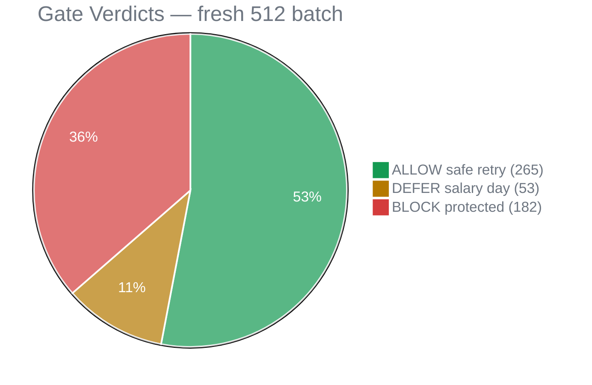

# Revive AI — Consent-First Payment Recovery Agent

<p align="center">
  <a href="https://revive-ai-production-3535.up.railway.app/"></a>
  <a href="#-the-numbers"></a>
  <a href="https://revive-ai-production-3535.up.railway.app/api/overview"></a>
</p>

<p align="center">
  <a href="https://revive-ai-production-3535.up.railway.app/#play"></a>
  <a href="https://revive-ai-production-3535.up.railway.app/#chat"></a>
  <a href="https://revive-ai-shxvy4uyvqydxucqxbqyin.streamlit.app"></a>
  <a href="https://revive-ai-production-3535.up.railway.app/#audit"></a>
  <a href="#-video-demo"></a>
</p>

<details open>
<summary>📁 <b>Table of Contents</b></summary>

- [The Problem](#the-problem-2026-reality)
- [The 5 Laws](#️-the-5-laws)
- [Track 03 Alignment](#-track-03-alignment)
- [The Numbers](#-the-numbers)
- [Architecture & The Consent Gate](#-architecture--the-consent-gate)
- [Trust & Safety](#️-trust--safety)
- [Product Features](#-product-features)
- [12 Live Telemetry Panels](#-12-live-telemetry-panels)
- [The Agent Talks](#-the-agent-talks)
- [All Artifacts and Links](#-all-artifacts-and-links)
- [Run Locally](#️-run-locally)
- [Video Demo](#-video-demo)
- [Honesty & Assumptions](#-honesty--assumptions)

</details>

---

> ### 🎯 ₹6,87,655 recovered · 182 double-charges blocked · 98% diagnosis accuracy
>
> A consent-gated recovery agent for the **Razorpay Buildathon 2026 · Track 03: AI Revenue Recovery**.

---

> *"140 million payments fail in India every month. Most recovery systems are spam engines. We studied airlines, hospitals, and logistics to build a recovery system based on dignity, operational design, and strict consent."*

**One-sentence constitution:** *No money moves without valid consent. Never remind. Resolve.*

> **The LLM proposes why. The Policy Engine decides what. The Gate enforces if. The Database guarantees exactly once.**

---

## The Problem (2026 Reality)

| Metric | Value | Source |
|---|---|---|
| Monthly UPI transactions | **23.6 billion** (July 2026) | NPCI |
| Conservative failure rate | **~0.6%** (technical + business) | Industry estimates |
| Monthly payment failures | **~140 million** (~14 crore) | Calculated |
| Daily payment failures | **~4.6 million** (~46 lakh) | Calculated |
| Global revenue leakage | **$47B/year** — 1 in 5 e-commerce orders affected | Optimus |
| RBI Digital Payments E-Mandate Framework | **21 April 2026** — mandatory 24h pre-debit alerts; no AFA up to ₹15,000 | RBI |

With 23.6 billion monthly UPI transactions and ~140 million failures, blindly retrying these double-charges customers who already paid cash, spams salary-day shortages, and compounds mandate fines. **Revive AI diagnoses every failure, passes it through a deterministic Consent Gate, and only then acts.**

---

## ⚖️ The 5 Laws

1. **No money moves without valid consent.** (Protects against the Offline QR trap)
2. **Never remind. Resolve.** (A message must encode the diagnosis. "Bank was down, it's fixed now" > "Your cart is saved!")
3. **The best recovery is invisible.** (Silent retries for technical failures)
4. **Safety is rules, not AI.** (The Consent Gate and stopping rules are deterministic code, never probabilistic LLMs)
5. **Assign ownership before acting.** (Never sell debt as recovery. Check if infra, merchant, or customer owns the failure)

---

## 🎯 Track 03 Alignment

| Track 03 Direction | Fit | Implementation |
|---|---|---|
| **Payment degradation + root cause** | ✅✅✅ | `diagnosis.py` + `health.py` (Redis) + `ev_optimizer.py` |
| **Checkout drop-off recovery** | ✅✅✅ | Mechanism Swap + `dropoff_funnel.py` + `poll_orders.py` |
| **Failed subscription recovery** | ✅✅✅ | `/webhooks/razorpay/subscriptions` + mandate gate + sequencer |
| **B2B receivables recovery** | ✅✅✅ | `receivables.py`: dispute halt + payment-plan splitting |
| **Mandate expiry assurance** | ✅✅✅ | `audit.py` (RBI 24h pre-debit) + R-01 + Mandate Sequencer |
| **Hinglish voice recovery** | ✅✅✅ | `voice.py`: ElevenLabs → edge-tts → text fallback, opt-in voice replies |
| **Drop-to-pay flow tracker** | ✅✅✅ | `dropoff_funnel.py` + `/api/funnel` live endpoint |
| **Promise-to-pay tracker** | ✅✅✅ | `app/db/models.py:Promise` + fulfillment stats |

---

## 📈 The Numbers

| 🧾 Failures | 🛡️ Blocked | 💰 Recovered | 🤝 Goodwill Protected |
|:---:|:---:|:---:|:---:|
| **512** | **182 (36%)** | **₹6,87,655** | **₹6,06,038** |

| Metric | Value |
|---|---|
| Failures processed | 512 (500 synthetic + live test payments) |
| Diagnosis accuracy (held-out, n=40, seeded) | **98% archetype / 95% owner** |
| Retries blocked by Consent Gate | **182 (36%)** |
| Safe retries executed (ALLOW) | **265** |
| Deferred to salary day (DEFER) | **53** |
| Revenue safely recaptured | **₹6,87,655** (incl. 1 real Razorpay test payment) |
| Customer goodwill protected | **₹6,06,038** (₹4,71,712 blocked + ₹1,34,326 deferred) |

### The Money Slide

```text
512 failures (₹12,93,693 At Risk)
├── Technical:     ₹3,45,090 recovered (silent retries, invisible recovery)
├── Intent:        ₹2,46,754 recovered (mechanism swaps & nudges)
├── Affordability: ₹0 now · ₹1,34,326 scheduled (Deferred EV to salary day)
├── Lifecycle:     ₹95,811 recovered (card updates) · ₹1,37,251 protected (mandate compliance)
└── In-flight:     ₹5,988 promised / live-test / human escalation

Total: ₹6,87,655 recovered · ₹4,71,712 protected · ₹1,34,326 deferred
Plus:  ₹5,988 in-flight / promised / escalated

"Customer-structural recovery = Rs.0. That's intentional. (Hotel 'Walk' Protocol)"
```

**Real test-mode IDs:** `pay_TSO8itQ6X4u1TT` (captured) · `pay_TSOALEUJL823Wr` (failed, replayable via `send_test_webhook`) · `pay_TSODxy4fmJFYBE` (authorized-stuck).

---

## 🖥️ Command Center Preview

<p align="center">
  
</p>

---

## 🧱 Architecture & The Consent Gate





### The 8 Rules (R-01 to R-08)

| Rule | Trigger | Verdict |
|---|---|---|
| **R-01** RBI Mandate | Pre-debit notice < 24h | 🔴 BLOCK |
| **R-02** Fee Shock | Abandonment at fee reveal | 🔴 BLOCK (merchant insight instead) |
| **R-03** Structural Stop | Repeated affordability failures | 🔴 BLOCK (Graceful Exit) |
| **R-04** Liquidity Defer | One-time insufficient balance | 🟡 DEFER to modal salary day |
| **R-05** Tech Retry | Transient infra failure | 🟢 ALLOW (silent retry) |
| **R-06** Default Allow | Safe path | 🟢 ALLOW |
| **R-07** Offline QR Trap ⭐ | `context=post_session_offline` | 🔴 BLOCK (prevents double-charge) |
| **R-08** Retry Budget | 3+ safe attempts per customer | 🔴 BLOCK (stopping rules over spam) |

---

## 🏛️ Trust & Safety

### Trust Boundary Matrix

| Component | Role | Execution Authority |
|:---|:---|:---:|
| **LLM (Groq/Gemini)** | Diagnoses archetype/owner; drafts messages | **NONE** |
| **Policy Engine** (`policy.py` v1.0.0) | Quiet hours, promise halt, action mapping | **ABSOLUTE** |
| **Consent Gate** (`gate.py`) | Hard rules R-01..R-08 | **ABSOLUTE** |
| **Message Validator** (`validator.py`) | Rejects pressure/fake promises/invented amounts | **ABSOLUTE** |
| **Database** | PK + unique constraints = exactly-once | **ABSOLUTE** |
| **Executor/Worker** | Dispatches retries/messages/voice | **BOUNDED** |
| **Frontend** | Telemetry + triggers only | **READ-ONLY** |

### Adversarial Testing

Proven robustness under failure conditions:

- **Concurrent Webhooks**: 10 simultaneous requests → exactly 1 succeeds
- **Economic Floor**: Interventions <₹100 are automatically skipped
- **Idempotency**: Duplicate payment_ids rejected at database level
- **Stale Recovery**: Crashes during LLM evaluation don't cause hangs

Run tests: `python scripts/stress_test.py`

### Security Posture

| Control | Implementation |
|---|---|
| **HMAC Webhook Verification** | Every Razorpay webhook is signature-checked; tampered payloads rejected |
| **Zero PAN Storage** | Card refs are opaque tokens (vault.tokenize) — no card data ever persisted |
| **Deterministic Consent Gate** | Financial actions decided by rules R-01..R-08, never by the LLM |
| **Prompt-Injection Guard** | SEC-INJECT blocks attempts to override safety rules |
| **Message Validator** | AI-drafted messages checked for pressure, fake promises, invented amounts |
| **Webhook Replay Protection** | HMAC signature + event-id + payment-id dedupe (RazorGuard-style) |

---

## 🧩 Product Features

### Diagnosis Engine

| Component | Implementation |
|---|---|
| **LLM Stack** | Groq gpt-oss-120b + Gemini failover |
| **Validation** | Pydantic strict-JSON with repair logic |
| **Accuracy** | 98% archetype / 95% owner (held-out, n=40, seeded) |
| **Fallback** | Deterministic rules when LLMs unavailable |

### Recovery Engine

| Feature | Inspiration | How It Works |
|---|---|---|
| **EV Optimizer** | ✈️ Airlines | `(Probability × Amount) − Cost of Attempt` |
| **Mechanism Swap** | 📦 Logistics | OTP fails → UPI Collect Request |
| **Liquidity Curves** | 🏥 Hospitals | Defer to salary day via customer payment history |
| **Graceful Exit** | 🏨 Hotels | Pause, no late fees for structural churn |

### Customer Experience

| Feature | Implementation |
|---|---|
| **Hinglish Voice Notes** | ElevenLabs → edge-tts → text fallback, opt-in |
| **WhatsApp Recovery** | Voice note + 1-tap Razorpay link, CTA matches archetype |
| **Chat Agent** | Language-aware, intent-routed, grounded ledger lookups |
| **Self-Serve Reschedule** | `/api/reschedule/{token}` — customer picks retry day, tokenized |

### Production Infrastructure

| Module | Implementation |
|---|---|
| **Retry Budget** | R-08: 3 safe attempts per customer, then hard stop |
| **Reconciliation** | `app/core/reconciliation.py`: limbo detection + REFUND_SLA jobs, NPCI T+48h window |
| **Cost Observability** | Attempt cost, net recovered, cost per ₹ recovered |
| **Mechanism Selector** | Success-rate routing: retries via the highest-success channel |
| **Mandate Sequencer** | T-24h notice → T+0 gated retry → T+48h human escalation |
| **Tokenized Method Refs** | Card-update links carry opaque tokens — zero PAN storage |
| **Connector Seam** | `app/connectors/`: processor-agnostic interface, Razorpay implementation shipped |

### Smart Policy Engine

| Feature | Where | Why It Matters |
|---|---|---|
| **Quiet Hours** | `app/core/policy.py` | TRAI DND 21:00–07:00 pause outreach |
| **Promise Halt** | `P_HALT` | Stops dunning mid-promise |
| **Expected Recovery Value** | Economics panel | Forward-looking ₹ metric weighted by live mechanism success rates |
| **Merchant Insights** | Telemetry panel | Money-valued fixes per merchant — Revive AI as free product consultant |
| **Recovery Center** | Telemetry panel | Deterministic score = verdict × amount × context × freshness; 3 priority buckets |

---

## 📊 12 Live Telemetry Panels

Every decision is visible, replayable, and measurable:

| Panel | What it Shows |
|---|---|
| **Failure Feed** | Every failed payment with archetype, owner, verdict, rule, status |
| **Deferred Jobs** | Queued salary-day retries and liquidity deferrals |
| **Merchant Audit** | Merchant-specific failure patterns and insights |
| **Recovery Economics** | Attempt cost, net recovered, cost per ₹ recovered, retry budget |
| **Reconciliation / Limbo Watch** | Deducted-but-not-settled payments, NPCI T+48h auto-reversal window |
| **Mechanism Selector** | Success-rate routing: which channel wins (UPI vs Card vs eMandate) |
| **Mandate Sequencer** | T-24h notice → T+0 gated retry → T+48h human escalation jobs |
| **Promise-to-Pay Tracker** | Customer commitments with pending / fulfilled / escalated stats |
| **B2B Receivables** | Dispute halts, payment plans, gentle reminders |
| **Drop-off Funnel** | Orders → fee-shock drops → OTP drops → attempted → recovered |
| **Verdicts (chart)** | ALLOW / DEFER / BLOCK distribution |
| **Archetypes (chart)** | Technical / Intent / Affordability / Lifecycle split |

---

## 💬 The Agent Talks

A full conversational agent on the live site — not a canned FAQ:

- **Language-aware**: auto-detects Hinglish vs English and replies in the same language
- **Intent routing**: 13 regex-matched intents with human-tone replies
- **Consent protection**: hard-blocks on "I don't want to pay this way" (Law 1)
- **Double-charge guard**: catches "paise kat gaye par merchant ko nahi mile" and prevents retry
- **Grounded ledger lookups**: paste a `pay_…` ID → agent queries the real database and explains that specific payment
- **Engine fallback**: for anything untrained, runs the real diagnosis + gate and explains the result
- **Opt-in voice**: toggle 🔊 to hear every reply spoken in natural Hinglish

---

## 📦 All Artifacts and Links

| Artifact | Link |
|---|---|
| **Live Command Center** | [revive-ai-production-3535.up.railway.app](https://revive-ai-production-3535.up.railway.app/) |
| **Interactive Playground** | [#play](https://revive-ai-production-3535.up.railway.app/#play) |
| **Chat with the Agent** | [#chat](https://revive-ai-production-3535.up.railway.app/#chat) |
| **Live API Overview** | [/api/overview](https://revive-ai-production-3535.up.railway.app/api/overview) |
| **Full Audit Trail** | [/api/audit](https://revive-ai-production-3535.up.railway.app/api/audit) |
| **Streamlit Dashboard** | [revive-ai-shxvy4uyvqydxucqxbqyin.streamlit.app](https://revive-ai-shxvy4uyvqydxucqxbqyin.streamlit.app) |
| **Failure Journal** | [`failure_journal.md`](failure_journal.md) |
| **Hinglish Voice Sample** | [`voice_technical.mp3`](voice_technical.mp3) |

---

## 🛠️ Run Locally

### Quick Start (3 minutes)

1. **Open the Command Center** → [revive-ai-production-3535.up.railway.app](https://revive-ai-production-3535.up.railway.app/)
2. **Try the Playground** → pick the **🏪 Offline QR trap (R-07 ★)** preset → tick "Include Hinglish voice reply" → press **Run the agent** → watch it diagnose + gate + act + speak
3. **Open the Chat widget (💬)** → type *"mere paise kat gaye par merchant ko nahi mile"* → get an instant Hinglish reply. Type `pay_sim_0499` → get a grounded ledger lookup
4. **Click the API** → `/api/overview` returns 512 failures, ₹6,87,655 recovered
5. **Run the audit** → `/api/audit` shows every decision logged end-to-end

### Local Setup

```bash
docker compose up -d
python -m venv venv && venv\Scripts\activate
pip install -r requirements.txt
python -m scripts.wipe_and_init          # 12 tables (incl. promises)
python -m app.data.generator             # 500 labeled failures
python -m app.data.simulate              # diagnose + gate (500/500 pure-LLM)
python -m app.data.recover               # execute actions
uvicorn app.main:app --reload            # API on :8000 + Command Center on /
streamlit run app/dashboard.py           # Dashboard on :8501
```

### Demo Scripts

```bash
python -m app.data.evaluate              # held-out accuracy (98% / 95%, seeded)
python -m scripts.send_test_webhook      # HMAC-verified real webhook + tamper rejection
python -m scripts.simulate_dropoffs      # Flow B: merchant insights
python -m scripts.simulate_b2b           # Flow D: dispute halt + payment plans
python -m scripts.simulate_promise       # Promise-to-Pay tracker
python -m scripts.simulate_promises      # seed 10 demo promises
python -m scripts.voice_demo             # Hinglish TTS (ElevenLabs)
python -m scripts.generate_money_slide   # dynamic per-archetype money slide
python -m scripts.dropoff_funnel         # drop-to-pay flow tracker
python -m scripts.simulate_mandate_sequence  # RBI-compliant dunning sequencer
pytest tests                             # 7 unit tests (R-01..R-07 full coverage)
```

---

## 🎥 Video Demo

A 3-minute walkthrough is available here: **[YouTube Unlisted Link — add after recording]**

The demo covers:
1. Command Center hero + stats count-up
2. Playground: Offline QR trap (R-07) with Hinglish voice reply
3. Chat widget: double-charge guard + payment-ID ledger lookup
4. Gate rules + Audit trail walkthrough
5. Closing: *"Never remind. Resolve."*

---

## 🙏 Honesty & Assumptions

- Simulation treats ALLOW retries as successful; production would track real Razorpay retry outcomes per attempt.
- Synthetic batch is labeled ground truth; accuracy measured on held-out sample (n=40, stratified, seeded).
- `failure_journal.md` logs every break, fix, and "aha" moment — including the day Groq retired our model mid-build.
- Accuracy is computed only over rows holding a pure-LLM diagnosis; rules-fallback rows (none in the shipped batch — verify via `scripts/verify_numbers.py`) are excluded from the calculation.
- Playground and chat runs never pollute the money-slide numbers — rows are deleted after the response.
- The B2B receivables panel is a deterministic simulation (seed=7) of the Flow D engine — it demonstrates dispute-halt and payment-plan logic, not live invoicing data.

---

<p align="center"><b>◆ Revive AI</b> — Never remind. Resolve.<br>
<i>No money moves without consent.</i></p>